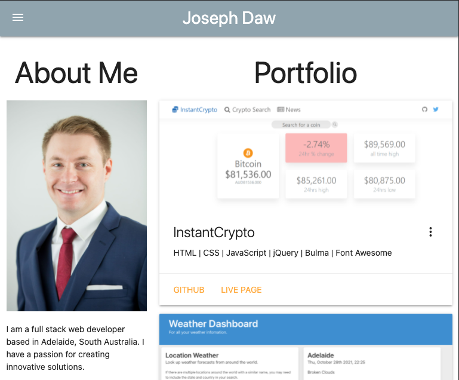
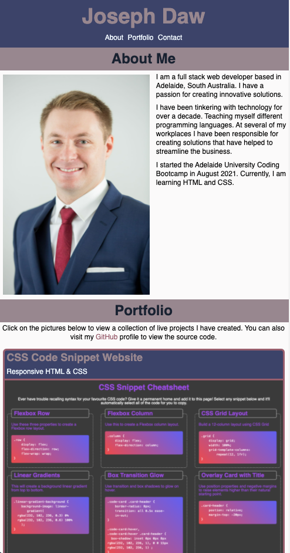

# My Portfolio Page

## Description
This is a responsive website designed using a "mobile first" philosophy to showcase my programming projects.

As I learn new technologies and improve my coding skills I plan to update this page accordingly. I will leave the previous comments with links to the various iterations as an homage to the development journey.

You can [view the current version](https://josephdaw.github.io/) on Github Pages at https://josephdaw.github.io/.

## Iteration #3

This version is using React and React Router to make this website. This is my first experience playing around with React. I am enjoying the ability to create components and re-use them; for example the NavBar. I still have a long way to go until I feel completely comfortable using React.

## Iteration #2

With this version I wanted to experiment with a framework that I hadn't used before. I ended up settling on [MaterializeCSS](https://materializecss.com/). I have found it to be a pretty user-friendly framework. The documentation has been easy enough to follow. The main hurdle is probably sorting out the colour scheme.

## Iteration #1

As the focus of this site has been responsive design, I have used CSS flex-box extensively to acheive this objective. This project has been a good, and sometimes painful, lesson in how to display a site responsively. This is one of the first website I have designed from the ground up, certainly the first one that is responsive.

This project has really cemented why developer tools like Chrome DevTools is such a powerful and useful resource. Up until now I have played around with it, without fully appreciating just how much it can assist with finding out how to achieve the style you are trying to achieve.

## License
This project is released under the [MIT License](LICENSE).